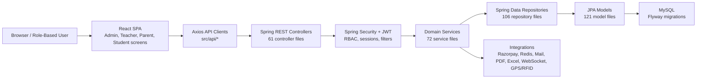

# SMS Project Current-State Documentation

**Snapshot date:** 2026-05-28  
**Project:** School Management System (SMS)  
**Repository root:** `C:\Users\ravi kumar\Desktop\sms`  
**Primary evidence:** source tree, `graphify-out/GRAPH_REPORT.md`, `graphify-out/graph.json`, `README.md`, `sms/pom.xml`, `school-frontend/package.json`, local validation commands.

---

## 1. Executive Summary

SMS is now a broad K-12 ERP platform rather than a narrow academic CRUD application. The current codebase contains a Spring Boot backend, a React frontend, a MySQL/JPA data model, migration artifacts, security/session infrastructure, and module surfaces for academics, finance, parent app, teacher OS, hostel, transport, HRMS, reports, backups, files, audit, and dashboard workflows.

The platform has strong product breadth, but the next engineering milestone is industrialization:

- make backend validation reliably runnable;
- reduce frontend warning debt;
- add automated tests around shared high-impact flows;
- tighten production configuration and documentation drift;
- make module ownership clearer as feature breadth grows.

### Current-state headline

| Area | Current read |
| --- | --- |
| Product breadth | Broad ERP footprint across school operations |
| Architecture | Layered monolith: React SPA -> Spring controllers -> services -> repositories -> MySQL |
| Backend size | 61 controllers, 72 services, 106 repositories, 121 models, 43 DTO files |
| Frontend size | 116 page files, 60 component files, 15 API modules, 10 hooks |
| Knowledge graph | 2,198 nodes, 2,880 edges, 158 detected communities in Graphify report |
| Frontend build | `npm.cmd run build` succeeds with warnings |
| Backend tests | `cmd.exe /c mvnw.cmd test` is blocked before Maven startup in the current environment |
| Main engineering risk | Broad feature surface is ahead of automated proof and tooling consistency |

---

## 2. Source Trail

This document intentionally favors repository evidence over aspirational descriptions.

| Source | Purpose |
| --- | --- |
| `README.md` | Product summary, setup notes, stated tech stack |
| `sms/pom.xml` | Backend framework version, Java version, dependencies |
| `school-frontend/package.json` | Frontend framework versions, build scripts, dependencies |
| `sms/src/main/java/com/school/sms/**` | Backend controllers, services, repositories, models, DTOs, config |
| `school-frontend/src/**` | Frontend pages, components, routes, hooks, API clients |
| `sms/src/main/resources/db/migration/**` | Flyway migration history |
| `docs/school_db.png` | Database/schema visual artifact |
| `graphify-out/GRAPH_REPORT.md` | Graph summary, god nodes, communities, knowledge gaps |
| `graphify-out/graph.json` | Node/link data backing graph analysis |

---

## 3. Repository Map

```text
sms/
├── README.md
├── docs/
│   ├── PROJECT_CURRENT_STATE.md
│   ├── audit-report.md
│   ├── db-seed-data.md
│   ├── design.md
│   ├── school_db.png
│   └── task.md
├── graphify-out/
│   ├── graph.html
│   ├── graph.json
│   └── GRAPH_REPORT.md
├── sms/                    # Spring Boot backend
│   ├── pom.xml
│   ├── mvnw / mvnw.cmd
│   └── src/main/
└── school-frontend/        # React frontend
    ├── package.json
    ├── public/
    └── src/
```

The repository currently contains significant uncommitted work across backend, frontend, docs, generated graph output, and presentation output. Treat the current state as an active development workspace, not a clean release branch.

---

## 4. Architecture Overview

SMS follows a conventional layered monolith pattern:



### Why this architecture works

- It is simple enough for rapid ERP feature development.
- The backend package structure maps clearly to common Spring Boot boundaries.
- The frontend is organized around role experiences and operational modules.
- The database layer is centralized, which helps school ERP reporting and cross-module workflows.

### Where the architecture needs discipline

- Shared hooks and utility functions are highly connected.
- Controller/service surfaces are expanding quickly.
- Some modules are thin or isolated in the graph.
- Test coverage is not yet proportional to product surface area.

---

## 5. Backend Documentation

### 5.1 Backend stack

From `sms/pom.xml`:

| Concern | Current technology |
| --- | --- |
| Runtime language | Java 17 |
| Framework | Spring Boot 3.5.13 |
| Web API | Spring MVC / `spring-boot-starter-web` |
| Security | Spring Security, JWT via `jjwt-*` |
| Persistence | Spring Data JPA, Hibernate, MySQL connector |
| Validation | Spring Boot validation starter |
| Migrations | Flyway core + Flyway MySQL |
| Cache / runtime dependency | Redis starter |
| Realtime | WebSocket starter |
| Email | Spring Boot mail starter |
| Rate limiting | Bucket4j |
| PDF generation | OpenPDF, Flying Saucer |
| Excel export | Apache POI |
| Testing | Spring Boot test, Spring Security test |

### 5.2 Backend package footprint

| Package area | Java files |
| --- | ---: |
| `controller` | 61 |
| `service` | 72 |
| `repository` | 106 |
| `model` | 121 |
| `dto` | 43 |
| `config` | 11 |
| `security` | 11 |
| `exception` | 5 |

### 5.3 Backend layers

#### Controllers

Controllers expose the API boundary. The current controller surface includes core school management plus newer operational modules:

- Core: `StudentController`, `TeacherController`, `ClassRoomController`, `SubjectController`, `AttendanceController`, `ExamController`, `FeeController`
- Auth/session/security: `AuthController`, `ParentAuthController`, `SessionController`, `SessionAuditController`, `RoleController`
- Parent ecosystem: `ParentController`, `ParentSuperAppController`
- Teacher workflows: `TeacherOSController`, `TeacherContentController`, `TeacherAnalyticsController`, `TeacherTimetableController`
- Finance: `ChartOfAccountController`, `ExpenseController`, `FinancialReportsController`, `JournalEntryController`, `PaymentController`, `TallyExportController`, `VendorController`
- Hostel/mess: `HostelAllocationController`, `HostelAttendanceController`, `HostelDashboardController`, `HostelInfrastructureController`, `MessBillingController`
- Transport: `TransportRouteController`, `VehicleController`, `DriverController`, `GpsTrackingController`, `RfidController`
- HRMS: `HrmsStaffController`, `HrmsAttendanceController`, `HrmsLeaveController`, `HrmsPayrollController`, `HrmsComplianceController`, `HrmsPerformanceController`
- Platform/admin: `BackupController`, `FileController`, `GlobalSearchController`, `DashboardController`, `DashboardExportController`, `RootDashboardController`, `ScheduledReportController`, `AuditLogController`

#### Services

Services contain business workflows and integration logic. Notable services include:

- `AuthService`, `RefreshTokenService`, `UserSessionService`, `UserRoleSyncService`
- `StudentService`, `TeacherService`, `ClassRoomService`, `SubjectService`
- `AttendanceService`, `AttendanceTemplateService`, `ExamService`, `MarkCalculationService`
- `FeeService`, `StudentLedgerService`, `ReceiptNumberService`, `DiscountAndScholarshipService`
- `FinanceDashboardService`, `FinancialReportsService`, `TallyExportService`
- `ParentService`, `ParentSuperAppService`
- `TeacherOSService`, `TeacherContentService`, `TeacherAnalyticsService`
- `HostelAllocationService`, `HostelAttendanceService`, `HostelBillingService`, `HostelDashboardService`, `MessBillingService`
- `TransportRouteService`, `VehicleService`, `GpsTrackingService`, `RfidProcessingService`, `TransportBillingService`
- `StaffOnboardingService`, `LeaveManagementService`, `PayrollProcessingEngine`, `PerformanceReviewService`, `PfEsiComplianceService`
- `BackupRestoreService`, `ExcelExportService`, `DocumentGenerationService`, `GlobalSearchService`, `ScheduledReportService`, `NotificationService`

#### Repositories

Repositories map domain objects to database persistence. There are 106 repository files, including top-level school repositories and module-specific folders for admin, finance, hostel, HRMS, and transport.

#### Models

The model layer has grown to 121 Java files. It includes:

- Academic: `Student`, `Teacher`, `ClassRoom`, `Subject`, `AcademicYear`, `Attendance`, `Exam`, `ExamPaper`, `Mark`, `Timetable`
- Identity: `User`, `Role`, `UserRole`, `Permission`, `UserSession`
- Parent: `Parent`, `ParentStudentLink`, parent-facing content models
- Finance: fee, ledger, payment, chart-of-account, expense, vendor, journal models
- Hostel/mess: rooms, beds, blocks, allocation, attendance, billing models
- HRMS: staff, payroll, attendance, leave, compliance models
- Transport: routes, stops, vehicles, drivers, GPS, RFID, assignments, fees, notifications

### 5.4 Backend configuration

Important runtime configuration lives under `sms/src/main/resources`:

| File | Purpose |
| --- | --- |
| `application.properties` | Common configuration, active profile, JWT defaults, server port, Redis, frontend URL, uploads |
| `application-dev.properties` | Local development profile |
| `application-prod.properties` | Production profile |
| `data.sql` | Seed data |
| `hostel_seed.sql` | Hostel seed data |
| `db/migration/*.sql` | Flyway migration scripts |

### 5.5 Backend validation status

Attempted command:

```powershell
cd sms
cmd.exe /c mvnw.cmd test
```

Observed status:

- The Maven wrapper failed before Maven startup with `Cannot start maven from wrapper`.
- `mvn.cmd` was not available on `PATH` in the environment.
- Java is available, but the current validation blocker is Maven wrapper/tooling, not a test assertion failure.

Recommended fix path:

1. Repair or replace the Maven wrapper configuration.
2. Ensure a local Maven binary is available or wrapper download/startup is reliable.
3. Add a CI command that runs backend tests without relying on local machine quirks.
4. Re-run `mvnw.cmd test` after wrapper repair.

---

## 6. Frontend Documentation

### 6.1 Frontend stack

From `school-frontend/package.json`:

| Concern | Current package |
| --- | --- |
| Framework | React `^18.3.1` |
| Routing | React Router DOM `^6.22.3` |
| API calls | Axios `^1.14.0` |
| UI components | Ant Design `^6.4.3`, Tailwind config, custom CSS |
| Icons | Lucide React, React Icons |
| Charts | Recharts `^2.12.2` |
| Maps | Leaflet, React Leaflet |
| Realtime | STOMP + SockJS |
| PDF generation | jsPDF, jsPDF AutoTable |
| Build tool | Create React App / `react-scripts` |

> Note: the root `README.md` currently says React 19 and React Router 7, but `school-frontend/package.json` shows React 18.3.1 and React Router DOM 6.22.3. The package file should be treated as the executable source of truth until the README is updated.

### 6.2 Frontend source footprint

| Frontend area | Files |
| --- | ---: |
| `src/pages` | 116 |
| `src/components` | 60 |
| `src/api` | 15 |
| `src/hooks` | 10 |
| `src/utils` | 6 |
| `src/config` | 2 |
| `src/context` | 2 |
| `src/contexts` | 1 |
| `src/schema` | 2 |
| `src/services` | 2 |

### 6.3 Frontend product surfaces

The frontend has distinct role/module experiences:

- Admin dashboard and management pages
- Student list/detail/forms
- Teacher list/detail/forms
- Parent management and parent-facing pages
- Attendance, marks, exams, homework, timetable
- Finance screens
- Hostel screens
- HRMS screens
- Transport screens
- Teacher OS pages
- Dashboard widgets, global search, reports, drawers, modals

### 6.4 Shared frontend abstractions

Graphify identifies the following as central/highly connected:

| Node | Edges | Interpretation |
| --- | ---: | --- |
| `useToast()` | 69 | High-impact notification layer |
| `toList()` | 61 | Shared normalization/list handling |
| `useAuth()` | 45 | Core auth/session role dependency |
| `User` | 24 | Identity/domain hub |
| `AcademicYear` | 19 | Academic scoping hub |
| `Student` | 19 | Core domain hub |

These are leverage points. Changes to them should be protected with targeted tests because many pages and workflows depend on them.

### 6.5 Frontend validation status

Command run:

```powershell
cd school-frontend
npm.cmd run build
```

Observed status:

- Production build completed successfully.
- Build compiled with warnings.
- Warning themes:
  - unused imports;
  - unused state variables;
  - missing React hook dependencies;
  - dashboard and role page cleanup opportunities.

Recommended fix path:

1. Remove unused imports and dead state first.
2. Review hook dependency warnings manually; do not blindly add dependencies if it changes behavior.
3. Add lightweight smoke tests for login, protected routes, and dashboard rendering.
4. Consider splitting warning cleanup from feature work to reduce merge noise.

---

## 7. Data Model and Migrations

### 7.1 Data model posture

The data model is no longer just academic core. It now includes:

- identity and RBAC;
- academic years, classes, subjects, students, teachers;
- attendance sessions/templates/drafts;
- exams, papers, marks, rankings;
- parent and parent-student linking;
- finance ledgers, payments, receipts, reports;
- hostel, mess, room allocation, attendance, billing;
- HRMS staff, leave, payroll, compliance, performance;
- transport routes, stops, drivers, vehicles, GPS, RFID;
- audit, session, backup, notification, scheduled report artifacts.

### 7.2 Migration history

There are 24 migration files under `sms/src/main/resources/db/migration`.

Notable migrations include:

- `V2__dynamic_auth_system.sql`
- `V3__performance_indexes_and_constraints.sql`
- `V4__Parent_Ecosystem.sql`
- `V5__Parent_Super_App.sql`
- `V6__Teacher_OS_Implementation.sql`
- `V7__Attendance_Period_Support.sql`
- `V13__Enterprise_Student_Schema_Hardening.sql`
- `V14__Enterprise_Teacher_HRMS_Hardening.sql`
- `V16__Advanced_Admin_Modules.sql`
- `V17__Teacher_OS_Sync.sql`
- `V19__Finance_ERP_Foundation.sql`
- `V20__Admin_Operations.sql`
- `V21__HRMS_Foundation.sql`
- `V22__Transport_Management_Module.sql`
- `V24__Root_Admin_Dashboard_System_Alerts.sql`
- `V25__Scheduled_Reports_Schema.sql`

### 7.3 Data documentation artifacts

- `docs/school_db.png` provides a visual database/schema artifact.
- `docs/db-seed-data.md` documents seed data.
- `sms/src/main/resources/data.sql` and `hostel_seed.sql` provide executable seed artifacts.

---

## 8. Module Documentation

### 8.1 Identity, authentication, and RBAC

Current evidence:

- `AuthController`
- `AuthService`
- `SecurityConfig`
- `RoleController`
- `User`, `Role`, `UserRole`, `Permission`
- `UserSession`, `UserSessionRepository`, `UserSessionService`
- `RefreshTokenService`
- `RateLimitingService`
- parent-specific auth via `ParentAuthController`

Current read:

- JWT-based authentication is present.
- RBAC and permissions have dedicated entities/controllers.
- Session audit and user-session management are visible.
- Production hardening should ensure secrets fail closed and are never satisfied by development defaults.

### 8.2 Academics

Current evidence:

- `ClassRoomController`, `SubjectController`, `StudentController`, `TeacherController`
- `ClassRoomService`, `SubjectService`, `StudentService`, `TeacherService`
- `AcademicYear`, `ClassRoom`, `Subject`, `Student`, `Teacher`
- `AcademicYearRepository`, `ClassRoomRepository`, `SubjectRepository`, `StudentRepository`, `TeacherRepository`

Current read:

- Academic core is one of the most mature areas.
- The graph identifies `Student`, `AcademicYear`, and teacher-related services/repositories as important hubs.
- Academic year scoping should remain a first-class invariant across attendance, fees, exams, promotions, and reports.

### 8.3 Attendance

Current evidence:

- `AttendanceController`
- `AttendanceTemplateController`
- `AttendanceService`
- `AttendanceTemplateService`
- `Attendance`, `AttendanceSession`, `AttendanceDraft`, `AttendanceTemplate`
- attendance repositories and DTOs

Current read:

- Attendance has moved beyond simple records into sessions/templates/drafts.
- Period support appears in migrations.
- This should be a priority test area because it affects teachers, students, parents, reports, and finance/operations.

### 8.4 Exams and marks

Current evidence:

- `ExamController`
- `ExamService`
- `MarkCalculationService`
- `Exam`, `ExamPaper`, mark repositories and DTOs
- frontend exam and marks entry pages

Current read:

- Exam and mark flows are present.
- Ranking/reporting surfaces exist.
- Grade/mark changes should be covered by audit and permission checks.

### 8.5 Finance and payments

Current evidence:

- `FeeController`, `PaymentController`, `FinancialReportsController`, `TallyExportController`
- `FeeService`, `StudentLedgerService`, `ReceiptNumberService`, `FinanceDashboardService`, `FinancialReportsService`, `TallyExportService`
- Razorpay integration service
- chart of accounts, expenses, vendors, journal entries, ledgers, receipt sequence

Current read:

- Finance has grown into ERP territory.
- Payment and reporting adapters are visible.
- Receipt sequence repair migrations indicate active work on accounting correctness.
- Finance should be treated as a high-integrity module: audit trails, deterministic numbering, reconciliation, and role constraints matter.

### 8.6 Parent ecosystem

Current evidence:

- `ParentController`
- `ParentAuthController`
- `ParentSuperAppController`
- `ParentService`
- `ParentSuperAppService`
- `Parent`, `ParentStudentLink`
- parent-facing frontend pages for attendance, fees, homework, circulars, complaints, diary, downloads, leave, profile, PTM, results

Current read:

- Parent ecosystem is a real product surface, not a placeholder.
- Auth and child-linking flows are central.
- Parent views should be tested for ownership boundaries: a parent must only see linked children and related documents/fees/results.

### 8.7 Teacher OS

Current evidence:

- `TeacherOSController`
- `TeacherContentController`
- `TeacherAnalyticsController`
- `TeacherTimetableController`
- `TeacherOSService`
- `TeacherContentService`
- `TeacherAnalyticsService`
- frontend teacher pages for dashboard, exams, papers, homework, diary, lesson planning, quick attendance, resources, reports, timetable, settings

Current read:

- Teacher OS is a major current product surface.
- `TeacherOSService` and `TeacherRepository` appear as highly connected graph nodes.
- Teacher workflows should be protected by tests around attendance, classes, content, and analytics.

### 8.8 Hostel and mess

Current evidence:

- `HostelAllocationController`
- `HostelAttendanceController`
- `HostelDashboardController`
- `HostelInfrastructureController`
- `MessBillingController`
- `HostelAllocationService`
- `HostelAttendanceService`
- `HostelBillingService`
- `HostelDashboardService`
- `HostelInfrastructureService`
- `MessBillingService`
- hostel/mess models, repositories, DTOs, event listeners

Current read:

- Hostel/mess is active and broad.
- Graphify marks some hostel allocation areas as thin communities, which may mean either extraction limitations or integration still needs stronger edges.
- Billing, attendance, allocation, and absence events should be documented as workflows before release.

### 8.9 Transport

Current evidence:

- `TransportRouteController`
- `VehicleController`
- `DriverController`
- `GpsTrackingController`
- `RfidController`
- `TransportRouteService`
- `VehicleService`
- `DriverService`
- `GpsTrackingService`
- `RfidProcessingService`
- `TransportBillingService`
- transport models for route, vehicle, driver, GPS, RFID, assignments, fees, notifications

Current read:

- Transport module is moving beyond static route tables into device/event workflows.
- GPS/RFID flows need careful operational testing because they combine device events, student assignments, attendance/logging, and notifications.

### 8.10 HRMS and payroll

Current evidence:

- `HrmsStaffController`
- `HrmsAttendanceController`
- `HrmsLeaveController`
- `HrmsPayrollController`
- `HrmsComplianceController`
- `HrmsPerformanceController`
- `StaffOnboardingService`
- `LeaveManagementService`
- `PayrollProcessingEngine`
- `PerformanceReviewService`
- `PfEsiComplianceService`

Current read:

- HRMS/payroll is present and building.
- This module likely needs more documentation around payroll cycles, leave approval, compliance rules, and staff lifecycle workflows.

### 8.11 Platform operations

Current evidence:

- `BackupController`, `BackupRestoreService`
- `FileController`
- `AuditLogController`, `AuditLogService`
- `SessionAuditController`, `SessionAuditService`
- `GlobalSearchController`, `GlobalSearchService`
- `ScheduledReportController`, `ScheduledReportService`
- `DashboardExportController`
- `RootDashboardController`, `RootDashboardService`
- `WebSocketConfig`

Current read:

- Operational platform capabilities are present.
- Backup, audit, scheduled reporting, global search, export, and root dashboard features should be included in admin-runbook documentation before production use.

---

## 9. Knowledge Graph Findings

Graphify report summary:

| Metric | Value |
| --- | ---: |
| Files scanned | 533 |
| Approximate words | 819,745 |
| Nodes | 2,198 |
| Edges | 2,880 |
| Communities detected | 158 |
| Extracted edges | 67% |
| Inferred edges | 33% |
| Inferred edge count | 964 |
| Average inferred confidence | 0.8 |

### 9.1 Most connected abstractions

| Rank | Node | Edges | Meaning |
| ---: | --- | ---: | --- |
| 1 | `useToast()` | 69 | Notification UX is deeply shared |
| 2 | `toList()` | 61 | List normalization is deeply shared |
| 3 | `useAuth()` | 45 | Auth/role state is a central dependency |
| 4 | `User` | 24 | Identity model is a backend domain hub |
| 5 | `AcademicYear` | 19 | Academic scoping matters across modules |
| 6 | `Student` | 19 | Student is the core school domain object |
| 7 | `TeacherRepository` | 18 | Teacher data access is central |
| 8 | `TeacherOSService` | 18 | Teacher OS is highly connected |
| 9 | `ParentSuperAppController` | 17 | Parent super app is a major API surface |
| 10 | `AuthService` | 17 | Authentication service is core infrastructure |

### 9.2 Surprising graph connections

Graphify surfaced inferred calls such as:

- `StudentProfile()` -> `useAuth()`
- `DashboardRedirect()` -> `useAuth()`
- `Header()` -> `useAuth()`
- `AxiosToastWire()` -> `useToast()`
- `ProtectedRoute()` -> `useAuth()`

These are expected in a role-based SPA, but they make auth/toast behavior high-risk to modify casually.

### 9.3 Knowledge gaps

The graph report highlights:

- 82 isolated nodes;
- many thin communities;
- some thin module clusters around hostel allocation, WebSocket config, fee structure, admission CRM, repositories, and single-entity model files.

Interpretation:

- Some isolated nodes are normal for entity/model files.
- Some isolated nodes may represent incomplete integration or under-documented modules.
- Thin communities should be reviewed when preparing release docs or module ownership maps.

---

## 10. Validation and Quality Gates

### 10.1 Current command status

| Command | Result | Notes |
| --- | --- | --- |
| `npm.cmd run build` in `school-frontend` | Pass with warnings | Build artifacts generated |
| `cmd.exe /c mvnw.cmd test` in `sms` | Blocked before Maven startup | Wrapper/tooling issue, not a confirmed test failure |
| Graphify report | Available | `graphify-out/GRAPH_REPORT.md` generated 2026-05-26 |

### 10.2 Test coverage posture

Visible test files:

- Backend: `sms/src/test/java/com/school/sms/SmsApplicationTests.java`
- Frontend: `school-frontend/src/App.test.js`, `school-frontend/src/setupTests.js`

Current read:

- Automated test coverage is thin compared with product breadth.
- The first tests to add should protect shared, high-blast-radius flows:
  - login and token handling;
  - protected routes and role redirects;
  - student/teacher/class CRUD smoke paths;
  - attendance entry and retrieval;
  - fee payment / receipt sequence logic;
  - parent child-ownership checks;
  - teacher dashboard/attendance flows.

---

## 11. Current Risks

| Risk | Impact | Suggested response |
| --- | --- | --- |
| Backend validation blocked by Maven wrapper/tooling | High | Repair wrapper and add CI command |
| Thin automated tests | High | Add smoke/integration tests around central workflows |
| Frontend warning debt | Medium | Clean unused imports/state, then review hook deps carefully |
| Central shared hooks/utilities | Medium-high | Test `useAuth`, `useToast`, `toList` behaviors before refactor |
| Documentation drift | Medium | Align README versions with executable package files |
| Default JWT fallback in common config | High for production | Ensure prod fails closed if secrets are absent |
| Many isolated/thin graph communities | Medium | Add module ownership and workflow docs |
| Broad feature surface | Medium-high | Prioritize stabilization before adding new modules |

---

## 12. Recommended 30/60/90-Day Plan

### 0-30 days: Stabilize

- Fix Maven wrapper / backend test execution.
- Add CI checks for backend tests and frontend build.
- Clean no-risk frontend warnings.
- Review hook dependency warnings manually.
- Update README tech-stack versions.
- Ensure production config cannot run with placeholder secrets.
- Document environment variables in one canonical place.

### 31-60 days: Prove core workflows

- Add backend integration tests for auth, student, teacher, class, attendance, exams, fees.
- Add frontend route smoke tests for admin, teacher, parent flows.
- Add parent ownership tests for child-specific data.
- Document API workflow examples for key modules.
- Review isolated graph nodes and assign module ownership.
- Create a repeatable demo seed-data script and demo-login guide.

### 61-90 days: Productize

- Add observability/health runbook.
- Document backup and restore drills.
- Create finance reconciliation and receipt sequence runbook.
- Add release checklist and migration checklist.
- Create module-level acceptance criteria.
- Prepare stakeholder/demo documentation.

---

## 13. Setup and Local Runbook

### 13.1 Prerequisites

- JDK 17+
- Node.js 18+
- MySQL 8+
- Redis if Redis-backed behavior is required
- Maven wrapper functioning, or Maven installed locally

### 13.2 Backend setup

```powershell
cd sms
.\mvnw.cmd spring-boot:run
```

Important configuration:

- Common config: `sms/src/main/resources/application.properties`
- Dev config: `sms/src/main/resources/application-dev.properties`
- Prod config: `sms/src/main/resources/application-prod.properties`
- Environment values: root `.env` and/or OS environment variables

### 13.3 Frontend setup

```powershell
cd school-frontend
npm install
npm start
```

Production build:

```powershell
cd school-frontend
npm.cmd run build
```

### 13.4 Database setup

The backend uses MySQL and Flyway dependencies. Check:

- `sms/src/main/resources/db/migration`
- `sms/src/main/resources/data.sql`
- `sms/src/main/resources/hostel_seed.sql`
- `.env` database values

Before running production-like data:

1. Confirm database credentials.
2. Confirm active Spring profile.
3. Confirm migration order.
4. Back up the database.
5. Run migrations in a controlled environment.

---

## 14. Documentation Gaps to Fill Next

This document is current-state documentation. The next layer should be workflow-level documentation:

| Needed doc | Why it matters |
| --- | --- |
| `docs/API_WORKFLOWS.md` | Shows end-to-end request examples per module |
| `docs/ENVIRONMENT.md` | Canonical environment variables and profile behavior |
| `docs/SECURITY_RUNBOOK.md` | Auth, RBAC, file access, secrets, audit, rate limiting |
| `docs/DATABASE_MIGRATIONS.md` | Migration sequence, rollback expectations, seed data |
| `docs/TESTING_STRATEGY.md` | What must be tested before release |
| `docs/DEMO_SCRIPT.md` | Repeatable demo path for stakeholders |
| `docs/MODULE_OWNERSHIP.md` | Maps modules to files and maintainers/owners |

---

## 15. Release Readiness Checklist

Use this checklist before treating the current SMS state as release-ready:

- [ ] Backend tests run successfully from a clean checkout.
- [ ] Frontend build passes with warnings either eliminated or accepted.
- [ ] README tech-stack versions match package files.
- [ ] Production secrets are mandatory and not satisfied by weak defaults.
- [ ] Database migrations run on a fresh database.
- [ ] Seed data is documented and repeatable.
- [ ] Auth/role access is tested for admin, teacher, parent, student.
- [ ] Parent ownership boundaries are tested.
- [ ] File access is role/ownership protected.
- [ ] Receipt sequence and finance workflows are tested.
- [ ] Audit logs exist for sensitive operations.
- [ ] Backup and restore path is tested.
- [ ] Module ownership is documented.
- [ ] High-connectivity hooks/utilities have tests.
- [ ] Deployment runbook exists.

---

## 16. Bottom Line

SMS has reached a platform-shaped current state. The codebase shows real ERP breadth: academics, finance, parent app, teacher OS, hostel, transport, HRMS, reporting, audit, backup, and integration surfaces are all present.

The next step is not simply adding more modules. The next step is making the existing breadth provable:

- reliable backend tests;
- cleaner frontend build hygiene;
- stronger auth/ownership checks;
- updated documentation;
- repeatable seed/demo workflows;
- module-level acceptance criteria.

Once those are in place, the project will be much easier to demo, sell, maintain, and safely extend.
